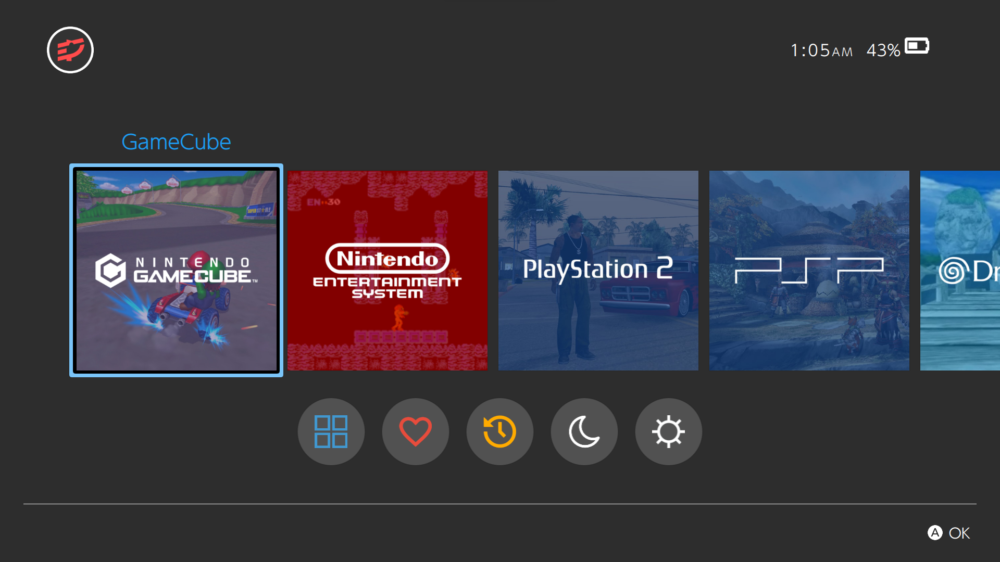
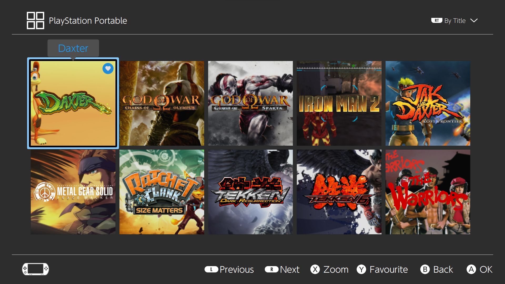
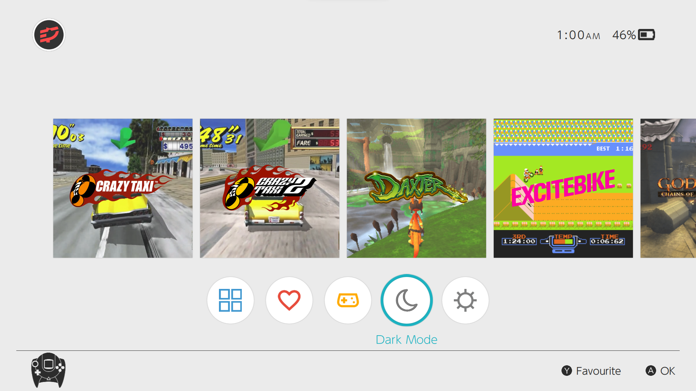

# switchUI

A clean and simple theme inspired by the experience of the Nintendo Switch for the 
[Pegasus Frontend](http://pegasus-frontend.org/).

This is a fork of [skylineOS++](https://github.com/ismaelestalayo/skylineOSP), which is a fork of skylineOS-a fork of switchOS.

## Installation

Simply download the theme and place it in your [Pegasus theme directory](http://pegasus-frontend.org/docs/user-guide/installing-themes/) under a folder called switchUI.

See [wiki](https://github.com/RBertoCases/skylineOS/wiki) for more information.

## Version history

v0.3
- Add "Android" button in place of previously "All Software" (<i>simply an exit button</i>)

v0.2
- Changed font weight, colours and selector in Theme Settings to look closer to NS
- ~~Changed options from Yes/No to On/Off~~
- Changed font to "SF Pro Display Regular" and bumped sizes
- Moved "All Software" back to the game row
- Fixed the bug in Systems screen > bottom bar buttons, where if selector is right of Systems it'll skip Systems if moving to left

v0.1
- Changed the titles and size of the buttons to match my liking: Favourite, Previous, Next, OK,...
- Changed games titles to unwrapped and slightly increased size
- Fixed the bug where the battery sits higher than the rest
- Fixed the bug in the recent screen where the selector keeps showing in the game row after moving to bottom row