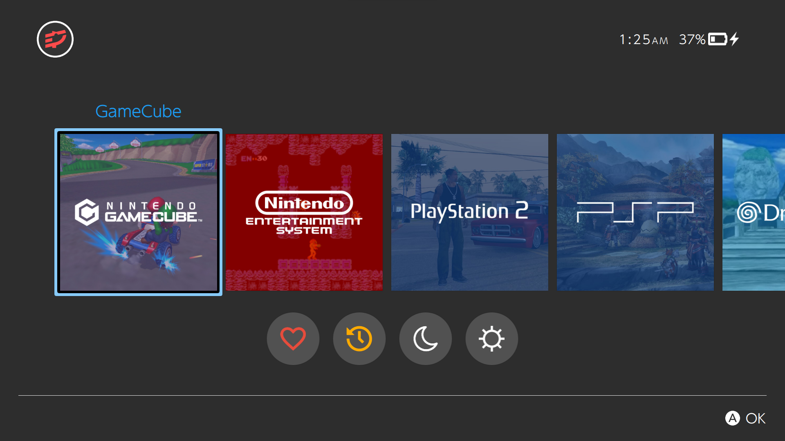
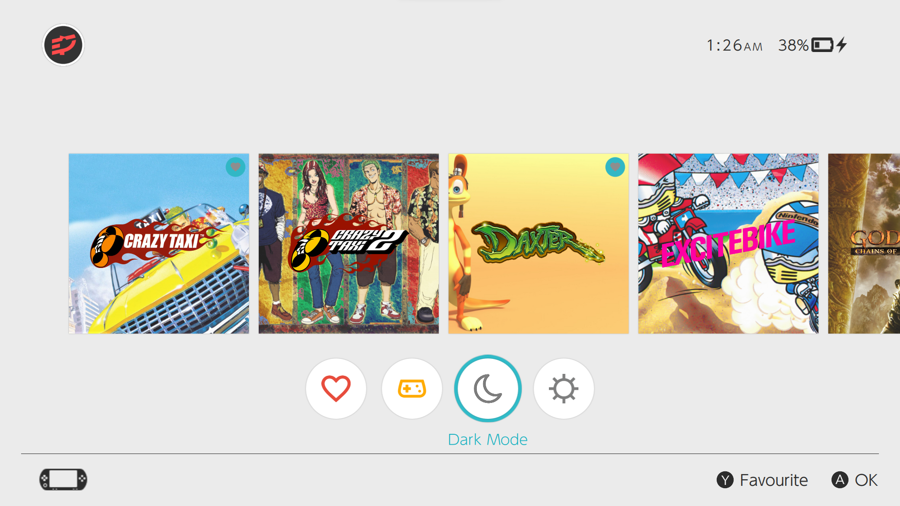

# switchUI

A clean and simple theme inspired by the experience of the Nintendo Switch for the 
[Pegasus Frontend](http://pegasus-frontend.org/).

This is a fork of [skylineOS++](https://github.com/ismaelestalayo/skylineOSP), which is a fork of skylineOS-a fork of switchOS.

## Installation

Simply download the theme and place it in your [Pegasus theme directory](http://pegasus-frontend.org/docs/user-guide/installing-themes/) under a folder called switchUI.

See [wiki](https://github.com/RBertoCases/skylineOS/wiki) for more information.

## Version history

v0.1
- Changed the button titles at the bottom bar to match my liking: Favourite, Previous, Next, OK,...
- Changed games titles to unwrapped and slightly increased size
- Fixed the bug where the battery sits higher than the rest
- Fixed the bug in the recent screen where the selector keeps showing in the game row after moving to bottom row